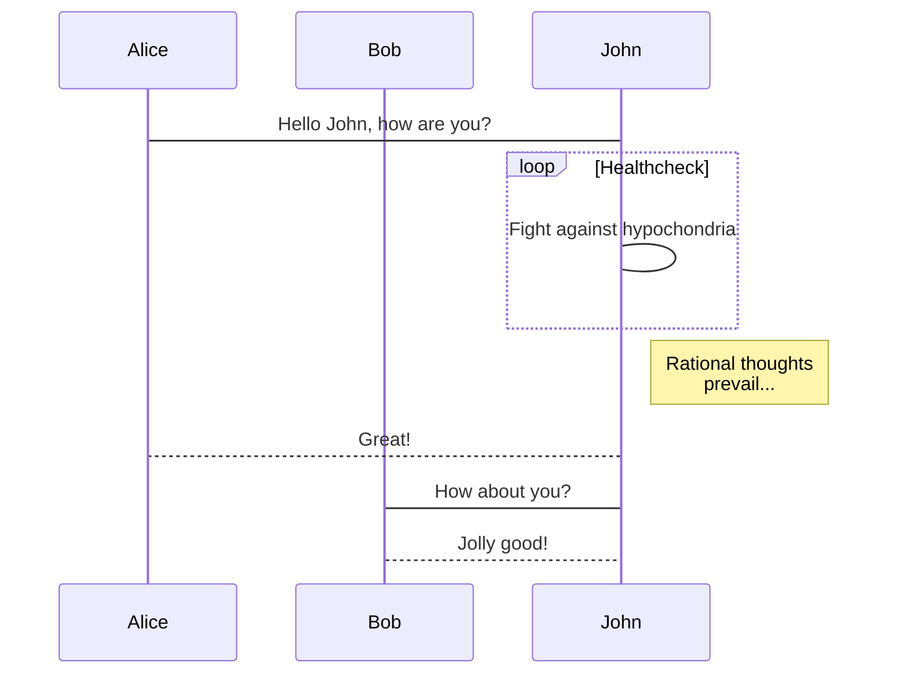
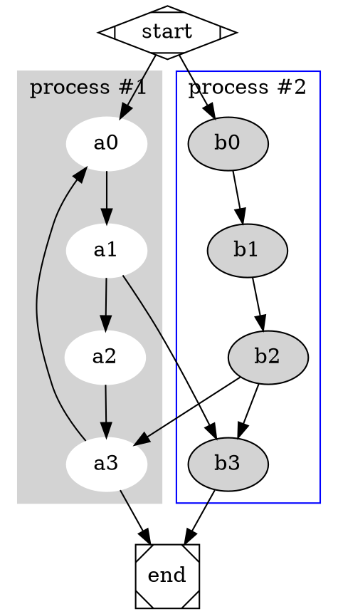
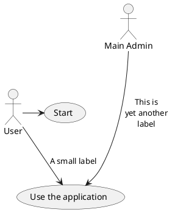

# Markdown 语法
## CommonMark 语法
### 斜体

    *Italic斜体*  或者  _Italic斜体_

显示如下：\
*Italic斜体*

### 加粗
    **Bold加粗** 或者 __Bold加粗__

显示如下：\
**Bold加粗**
### 嵌套
    **格式*嵌套*，可多层**
显示如下：\
**格式*嵌套*，可多层**

### 转义
    显示星号\* ,  显示\_

显示如下：(所有的字符都可以放在 \\ 后面转义)\
显示\*

### 标题
```
# Heading 1 `<h1>`
## Heading 2 `<h2>`
### Heading 3 `<h3>`
###### Heading 6 `<h6>`

Heading 1
=========

Heading 2
---------
```
显示如下：
# Heading 1
## Heading 2
### Heading 3

### 网址
	地址：<https://www.baidu.com>
显示如下：\
地址：https://www.baidu.com
### 链接
```
[Link](http://a.com)
或者
[Link][1]
⋮
[1]: http://b.org
```
显示如下：\
[Link](https://zh.mweb.im/asset/img/set-up-git.gif)
### 图片
```

或者
![Image][1]
⋮
[1]: http://url/b.jpg
```
显示如下：\

### 引用文本
```
> Blockquote
>
> The second paragraph.
```
>Blockquote
>
>The second paragraph.
### 无序列表
```
* List
* List
* List
或者
- List
- List
- List
```
显示如下：
* List
* List
* List

### 有序列表
```
1. One
2. Two
3. Three
或者
1) One
2) Two
3) Three
```
1. One
2. Two
3. Three

### 列表嵌套
```
* Item
    1. First Subitem
    2. Second Subitem
* Item
    - Subitem
    - Subitem
```

显示如下：
* Item
    1. First Subitem
    2. Second Subitem
* Item
    - Subitem
    - Subitem

### 分割线
```
Horizontal Rule
---

Horizontal Rule
***
```
显示如下：\
Horizontal Rule
***

### 内嵌代码
用2个反引号 \` 将内嵌代码包起来
 ```
 `Inline code` with backticks
 ```
显示如下：\
`Inline code` with backticks
### 代码块
用前后两组由3个反引号 \` 组成的代码块标识，将代码包裹起来
```
    ```
    # code block
    print '3 backticks or'
    print 'indent 4 spaces'
    ```
```
或者，在每一行前面加4个空格
```
····# code block
····print '3 backticks or'
····print 'indent 4 spaces'
```
显示如下：
```
# code block
print '3 backticks or'
print 'indent 4 spaces'
```
### 段落
```
The first paragraph.

The second paragraph.
```
显示如下：\
The first paragraph.

The second paragraph.
### 换行
```
The first line\
The second line
```
The first line\
The second line

## GitHub Flavored Markdown扩展
### 删除
    ~~这是删除文本~~
显示如下：\
~~这是删除文本~~
### 锚点
    [回到第一部分](#CommonMark 标准)
显示如下：\
[回到第一部分](#CommonMark-标准)
### 高亮
代码语法高亮
```
```ruby
require 'redcarpet'
markdown = Redcarpet.new("Hello World!")
puts markdown.to_html
\```
```
显示如下：
```ruby
require 'redcarpet'
markdown = Redcarpet.new("Hello World!")
puts markdown.to_html
```
### 表格
```
| First Header  | Second Header |
| ------------- | ------------- |
| Content Cell  | Content Cell  |
| Content Cell  | 姚明<br>易建联  |
```
显示如下：\
三行两列带表头的表格，表格内换行用HTML标签

表格	First Header | Second Header
------------ | -------------
Content from cell 1 | Content from cell 2
Content in the first column | 姚明<br>易建联

对齐方式，左对齐、居中对齐、右对齐

| Left-aligned | Center-aligned | Right-aligned |
| :---         |     :---:      |          ---: |
| git status   | git status     | git status    |
| git diff     | git diff       | git diff      |


### 提醒
    Hey @kneath
显示如下：\
Hey @kneath
### 任务列表
```
- [x] This is a complete item
- [ ] This is an incomplete item
```
- [x] This is a complete item
- [ ] This is an incomplete item

以括号开头的例外处理
```
-[ ] \(Optional) 打开后续议题
```
显示如下：
- [x] This is a complete item
- [ ] \(Optional) 打开后续议题


## MWeb 拓展语法
### MWeb 画图

### mermaid

mermaid 是比较流行的画图库，它支持流程图、顺序图和甘特图，它的官网为：<https://mermaidjs.github.io/> ，在 MWeb 中使用 mermaid 的语法就是声明代码块的语言为 mermaid，代码块中再写上 mermaid 的画图语法即可，你可以把下面的语法复制到 MWeb 中查看效果。

    ```mermaid
    sequenceDiagram
        participant Alice
        participant Bob
        Alice->John: Hello John, how are you?
        loop Healthcheck
            John->John: Fight against hypochondria
        end
        Note right of John: Rational thoughts <br/>prevail...
        John-->Alice: Great!
        John->Bob: How about you?
        Bob-->John: Jolly good!
    ```

**效果如下：**



### Graphviz

Graphviz 是开源的画图软件，它的官网为 <http://www.graphviz.org/>。MWeb 采用的是 Graphviz 的 js 版本的实现 <http://viz-js.com/>，可以解析 Graphviz 语法以生成图片。你可以将以下语法复制到 MWeb 中进行尝试。在尝试时可以把 dot 换成 circo, fdp, neato, osage, twopi 这几种来尝试效果。

    ```dot
    # http://www.graphviz.org/content/cluster
    digraph G {

    	subgraph cluster_0 {
    		style=filled;
    		color=lightgrey;
    		node [style=filled,color=white];
    		a0 -> a1 -> a2 -> a3;
    		label = "process #1";
    	}

    	subgraph cluster_1 {
    		node [style=filled];
    		b0 -> b1 -> b2 -> b3;
    		label = "process #2";
    		color=blue
    	}
    	start -> a0;
    	start -> b0;
    	a1 -> b3;
    	b2 -> a3;
    	a3 -> a0;
    	a3 -> end;
    	b3 -> end;

    	start [shape=Mdiamond];
    	end [shape=Msquare];
    }
    ```

**效果如下：**



### echarts

echarts 是百度出口的 js 画图库，它的网址为：<http://echarts.baidu.com/index.html>，功能非常强大，MWeb 支持 echarts 的一些基本的用法，太高级的不支持。你可以将以下语法复制到 MWeb 中进行尝试。你也可以去 <http://echarts.baidu.com/examples/index.html> 这个网址查看一些例子，要注意的是 MWeb 只能解析 `option = {}` 这种简单的，不过应该是足够使用了。

    ```echarts
    option = {
        xAxis: {
            type: 'category',
            data: ['Mon', 'Tue', 'Wed', 'Thu', 'Fri', 'Sat', 'Sun']
        },
        yAxis: {
            type: 'value'
        },
        series: [{
            data: [820, 932, 901, 934, 1290, 1330, 1320],
            type: 'line'
        }]
    };
    ```

**效果如下：**

```echarts
option = {
    xAxis: {
        type: 'category',
        data: ['Mon', 'Tue', 'Wed', 'Thu', 'Fri', 'Sat', 'Sun']
    },
    yAxis: {
        type: 'value'
    },
    series: [{
        data: [820, 932, 901, 934, 1290, 1330, 1320],
        type: 'line'
    }]
};
```
### plantuml

plantuml 的网址为：<http://www.plantuml.com/>，直接上去看更能了解。MWeb 对 plantuml 的支持的方式是引用 plantuml 服务器生成的图片，你可以将以下语法复制到 MWeb 中进行尝试。

    ```plantuml
    @startuml

    User -> (Start)
    User --> (Use the application) : A small label

    :Main Admin: ---> (Use the application) : This is\nyet another\nlabel

    @enduml
    ```

**效果如下：**



### 顺序图和流程图

顺序图和流程图是使用 <http://bramp.github.io/js-sequence-diagrams/>, <http://adrai.github.io/flowchart.js/> 这两个画图库，以下是它在 MWeb 中的 Markdown 语法。

	```sequence
	张三->李四: 嘿，小四儿, 写博客了没?
	Note right of 李四: 李四愣了一下，说：
	李四-->张三: 忙得吐血，哪有时间写。
	```

	```flow
	st=>start: 开始
	e=>end: 结束
	op=>operation: 我的操作
	cond=>condition: 确认？

	st->op->cond
	cond(yes)->e
	cond(no)->op
	```

**效果如下：**

```sequence
张三->李四: 嘿，小四儿, 写博客了没?
Note right of 李四: 李四愣了一下，说：
李四-->张三: 忙得吐血，哪有时间写。
```

```flow
st=>start: 开始
e=>end: 结束
op=>operation: 我的操作
cond=>condition: 确认？

st->op->cond
cond(yes)->e
cond(no)->op
```


### LaTeX （MathJax 渲染）

Markdown 语法：

```
块级公式：
$$	x = \dfrac{-b \pm \sqrt{b^2 - 4ac}}{2a} $$

\\[ \frac{1}{\Bigl(\sqrt{\phi \sqrt{5}}-\phi\Bigr) e^{\frac25 \pi}} =
1+\frac{e^{-2\pi}} {1+\frac{e^{-4\pi}} {1+\frac{e^{-6\pi}}
{1+\frac{e^{-8\pi}} {1+\ldots} } } } \\]

行内公式： $\Gamma(n) = (n-1)!\quad\forall n\in\mathbb N$
```

效果如下（MWeb软件支持）：

块级公式：
$$	x = \dfrac{-b \pm \sqrt{b^2 - 4ac}}{2a} $$

\\[ \frac{1}{\Bigl(\sqrt{\phi \sqrt{5}}-\phi\Bigr) e^{\frac25 \pi}} =
1+\frac{e^{-2\pi}} {1+\frac{e^{-4\pi}} {1+\frac{e^{-6\pi}}
{1+\frac{e^{-8\pi}} {1+\ldots} } } } \\]


行内公式： $\Gamma(n) = (n-1)!\quad\forall n\in\mathbb N$


### 脚注（Footnote）

Markdown 语法：

```
这是一个脚注：[^sample_footnote]
```

效果如下：

这是一个脚注：[^sample_footnote]

[^sample_footnote]: 这里是脚注信息
